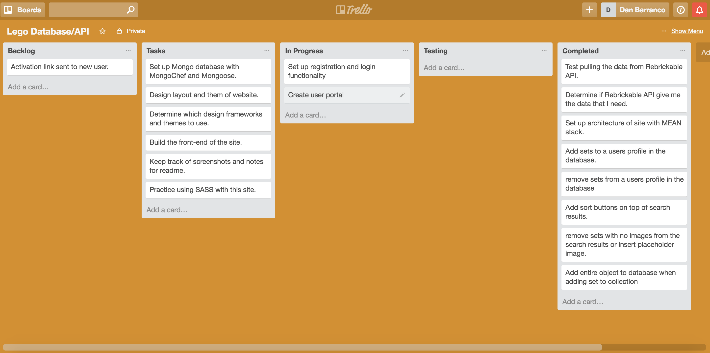
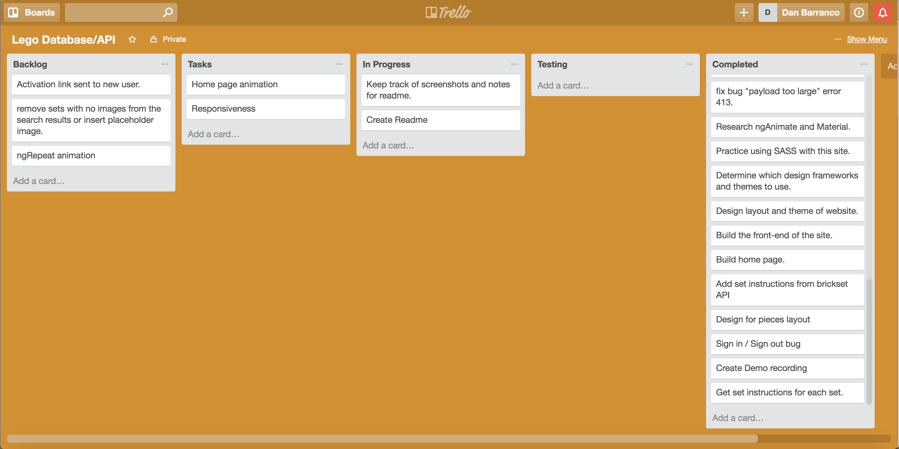
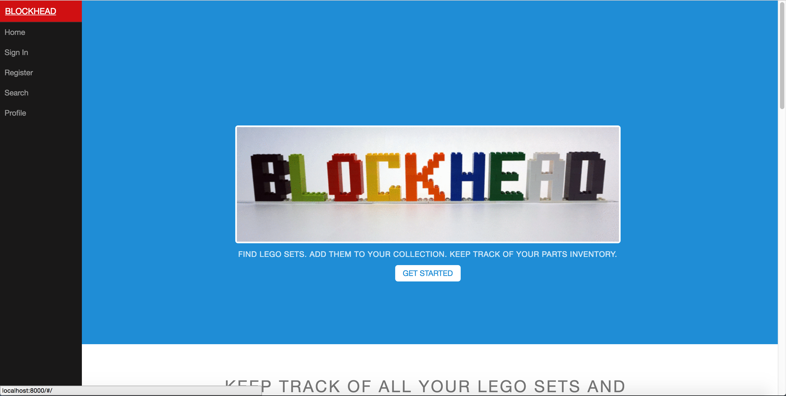
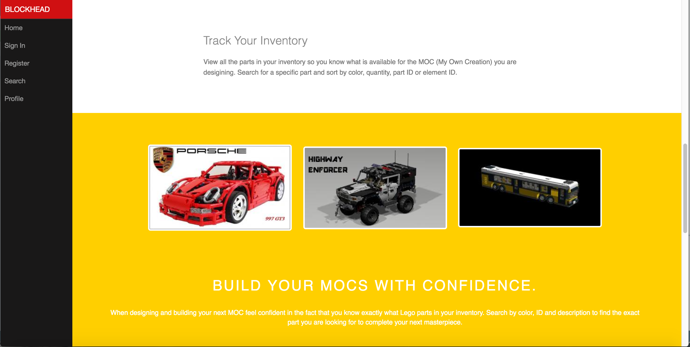
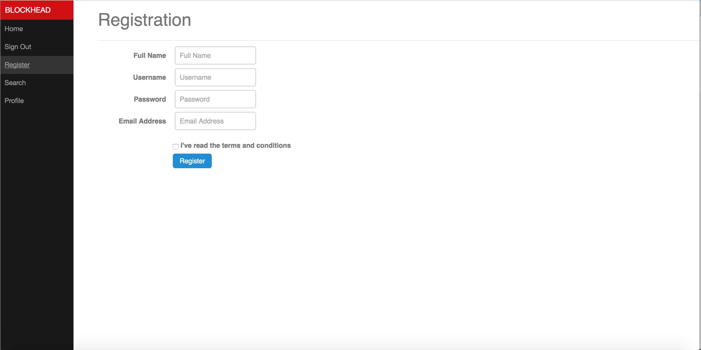
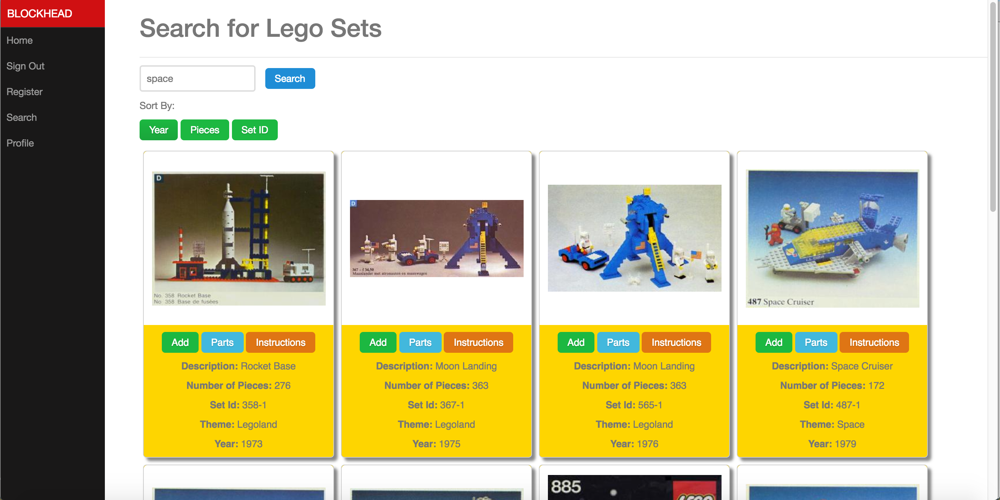
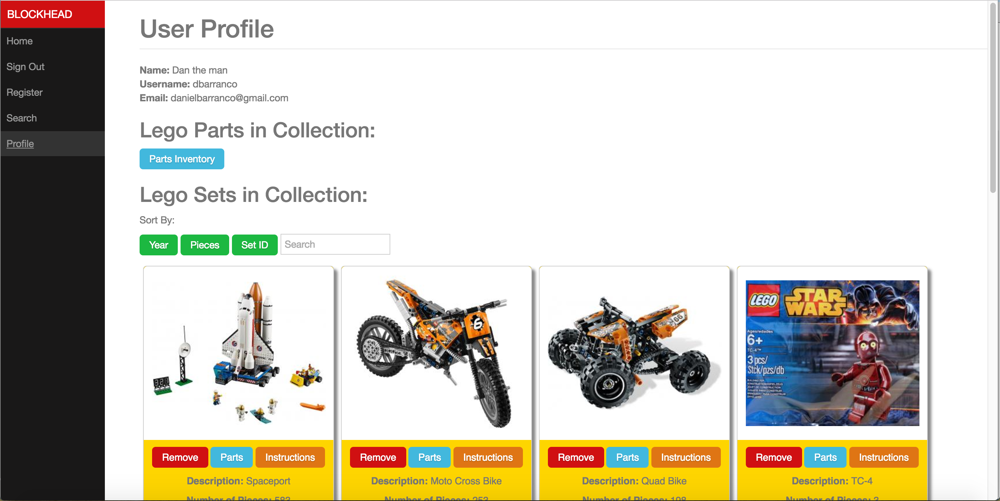
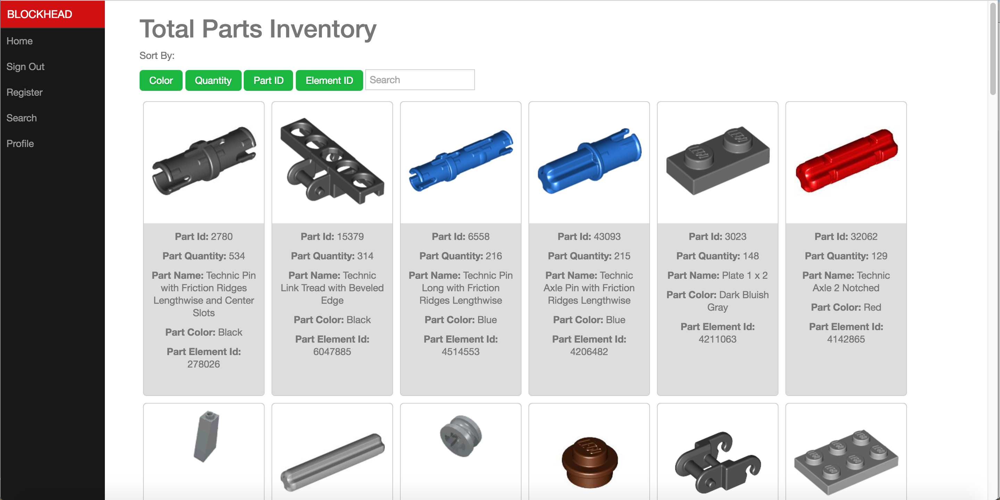

#Blockhead

* The final project for DigitalCrafts that must utiilze a server side languange and eight of the following:
	* Use of a web framework (express, flask, etc.)
	* Use of a relational database (MySQL, postgres, MSSQL, etc.)
	* Use of NoSQL (mongo, couch, etc.)
	* Use of socket.io or other web socket system
	* Object Oriented Structure
	* Functional Programming Structure
	* Use of at least two modules, libraries, etc. in the chosen language
	* Use of a front-end framework (angular, react, ember, etc.)
	* Use of ionic, cordova, or other 3rd party mobile app engine
	* User login must be hashed
	* JSON web tokens
	* CSS aggregation with SASS, LESS, or other
	* Some new framework, library, method, etc.
	* Integration with a single-board computer (such as an arduino or pi)

##Overview
Blockhead is a web app for Lego aficionados that allows users to search for Lego sets, add them to their collection, and in doing so, add all of the parts to their inventory as well.  This gives the user an inventory of not only all of their sets but all of the parts in their inventory.  This is very useful for collectors that need to know exactly what parts they have available to use for building MOCs (My Own Creations).

When a new user comes to the Blockhead page they register for a new account and are then redirected to the search page.  Here users can search for Lego sets by description, set ID, theme, year produced, or number of pieces.  The results of the search come from the Rebrickable API.  Once the results populate users can sort the results by year, number of pieces or set ID.  Each listing provides information about the set along with the ability to add the set to the users collection, a link to a listing of all the parts in the set, and a link to the instructions for the set.

Once the user has added sets to their collection, they can then go to their profile and see all these sets in their collection.  They can then go to their total parts inventory page which lists of the parts in their collection.  Once the user is on the total parts inventory page they can sort the parts by color, quantity, part ID or element ID.  Users can also search their parts inventory to find exactly the part they are looking for.

###Planning Phase

Planning Notes

Trello Board before

Trello Board after

###Technologies, Frameworks, and Programming Languages used
* HTML5
* CSS3
* JavaScript
* MongoDB
	* User information, user set information, and user part information is being stored in one collection in the database
* AngularJS
	* Used to make Blockhead a single page application.
	* Modules used
		* ngRoute
		* ngAnimate
		* ngCookies
		* dirPagination
* Node.js
* Node modules:
	* bcrypt
		* Used to hash user passwords
	* body-parser
	* cookie-parser
	* Express
	* Mongoose
	* rand-token
		* Generates random user authentication tokens
* Bootstrap
* Pure.css
* Sass

###Project Screenshots

Home Page 1

Home Page 2

Rgistration Page

Search Page

User Profile Page

Parts Inventory Page

##[Live Demo](http://blockhead.danielbarranco.com/#/)

